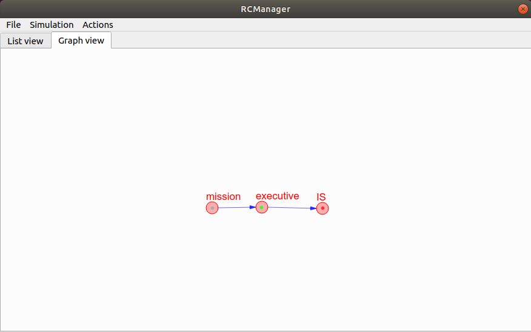
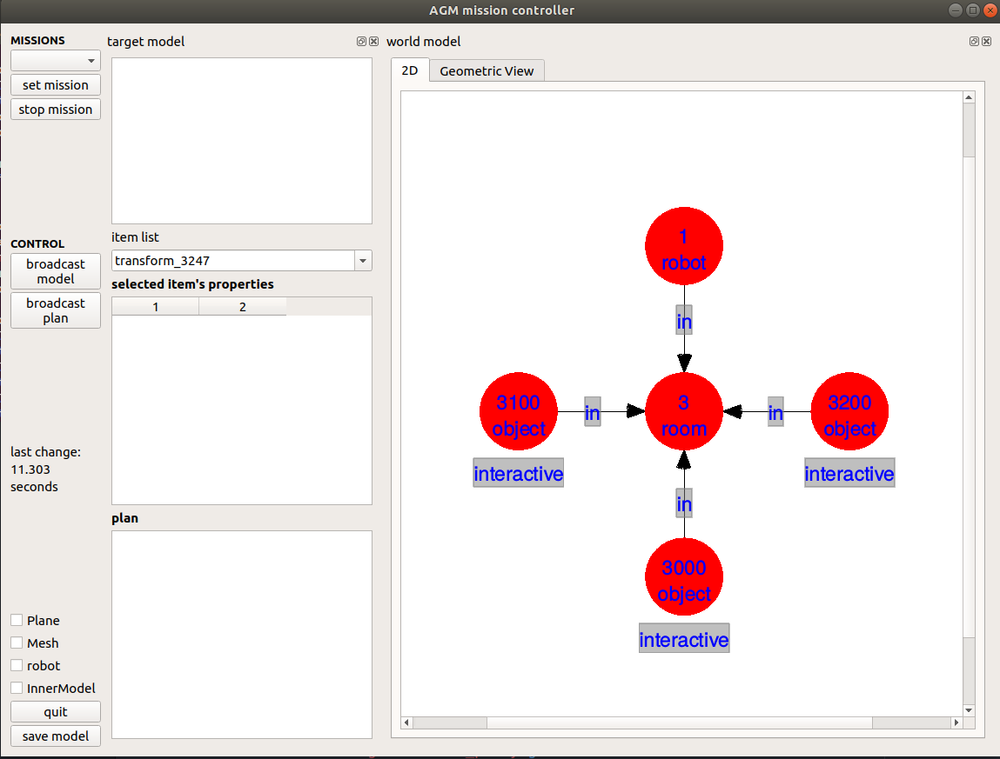

# Starting RcManagerSimple

* First you need to start RCremoteServer using the following command
```buildoutcfg
rcremoteserver
```
* After the server is started start the rcmanagersimple using the command
```buildoutcfg
cd ~/robocomp/components/robocomp-examples/getting-started/python/AGM_Agent/etc
rcmanagersimple deployment_sample.xml 
```

When it started you will see the GUI something like this.


right click on the mission node and click UP.\
Now you will see Mission Controller which will show you the DSR in realtime.


You will see every changes you done in the DSR here.
